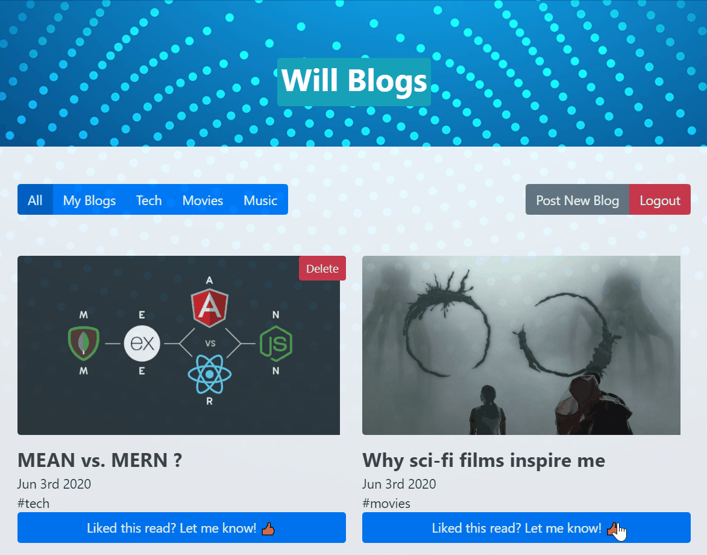

# WillBlogs ---> Will's Events
Personal Events CRUD web-app using the MERN stack ( MongoDB Atlas, ExpressJS , ReactJS , NodeJS ) 

# added aws S3 blob storage for the image files... may repurpose the site...

The app allows the user to sign up snd request to attend events posted . The information provided is hashed and salted using [bcrypt](https://www.npmjs.com/package/bcrypt). the information is never stored unhashed/salted anywhere. When making api calls, instead of identifying by user information and sending user data over the network, I used [Json Web Token](https://jwt.io/). The front end is using React with Hooks and some bootstrap.

[Useful when developing the server side](https://developer.mozilla.org/en-US/docs/Learn/Server-side/Express_Nodejs/routes)
&
[Useful when adding MongoDB to the server side](https://developer.mozilla.org/en-US/docs/Learn/Server-side/Express_Nodejs/routes)

## Using JWT to tokenize and cache localy
The sessions are stored on the users browser cache and then tokenized on the server allowing to see when users logged on.

## Allows the user to create and delete post and notifying with succesful api usage

## The liking mechanism links the user via events utilizing web sockets and fetcing data from Mongo DB

